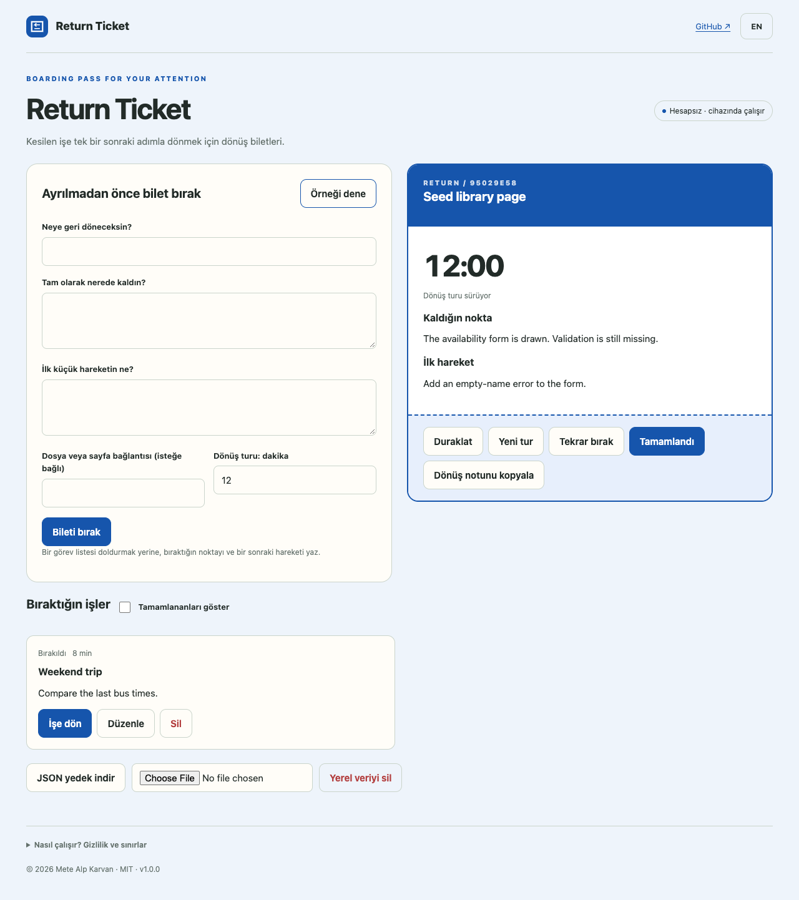

# Return Ticket

Leave a clear checkpoint before an interruption. Return with one next step.

**[Open the app](https://metealpkarvan.github.io/return-ticket/)** · [Türkçe](README.tr.md) · [Download runnable ZIP](https://github.com/metealpkarvan/return-ticket/releases/latest)

## Problem and idea

After answering a message or changing tasks, a broad to-do item rarely tells you which exact step you had reached. Reconstructing the stopping point becomes a second task.

A boarding pass for returning to work: capture a checkpoint, one small action and an optional workspace link, then use a short return session. The originating X/Twitter observation, access limitations and product inferences are documented in [research notes](docs/RESEARCH.md). This is an independent project, not an endorsed integration.

## Use it

1. Before switching, write a title, checkpoint and first small action.
2. Choose a 1–120 minute return session and optionally attach an http/https workspace URL.
3. Park the ticket. Resume it when ready; only one ticket can be active.
4. Pause, park again, start a fresh session or mark complete. Another ticket automatically parks the active one.
5. Copy the return note or export JSON. Completed tickets can be reopened.

Switch between Turkish and English. The sample button loads explicitly fictional data. After one successful online load, the service worker caches the app shell for offline reopening in the same browser. Browser support and storage settings vary; export important records.

## Download and run locally

The public demo needs no account or installation. Download **return-ticket-v1.0.0.zip** from Releases, extract it and serve the extracted directory:

    python3 -m http.server 8080 --bind 127.0.0.1

Open http://127.0.0.1:8080. Use a local HTTP server rather than double-clicking index.html; browsers restrict ES modules on file URLs. Release ZIPs contain no credentials or private user records. Verify with the release checksum file:

    shasum -a 256 -c SHA256SUMS.txt

## Privacy and limits

All logic runs in the browser. No AI API, account, analytics, third-party font or remote database. Text is not uploaded. External links open only on user action. Records use a namespaced localStorage key. JSON backups are unencrypted personal files. Import checks app identity, version, size and schema before asking to replace records.

No task-app integration, background notifications, automatic activity tracking or medical/productivity claims. Device wall-clock changes can affect timer calculations.

## Development

    git clone https://github.com/metealpkarvan/return-ticket.git
    cd return-ticket
    npm test
    npm run build
    npm start

Node.js 22+ is needed for tests/build; the app has **zero runtime packages**. Python 3 serves the app. The dist directory is a complete static deployment. GitHub Actions tests Node 22 and 24 and validates before publishing to Pages.

Core checks: Absolute deadlines, pause/resume, reload-compatible timing, session switching, single-active invariants and completed-ticket reopening. Browser acceptance and limitations are recorded in [verification](docs/VERIFICATION.md).

See [architecture](docs/DECISIONS.md), [contributing](CONTRIBUTING.md), [roadmap](docs/ROADMAP.md) and [changelog](CHANGELOG.md).

MIT © 2026 Mete Alp Karvan
